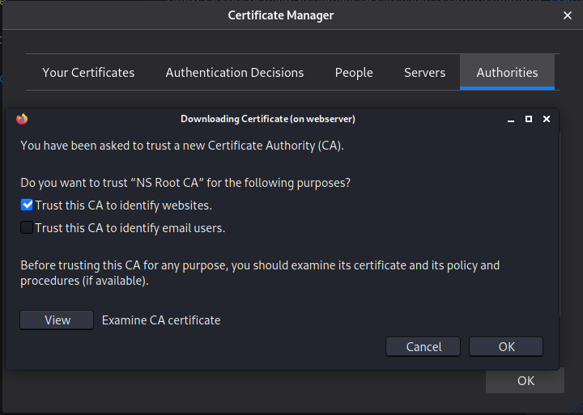
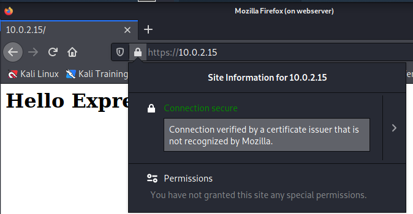

# Root Certification Authority with OpenSSL

## Setting everything up

Before proceeding, prepare your virtualized environment:

1. Create 2 different virtual machines: one for the CA and its OCSP responder and other one for the webserver.
2. Connect the two VMs to the same NAT network
3. Change the hostnames to be ca for the CA VM, and webserver for the webserver one. To do so:
    * Set the new hostname: `sudo hostnamectl set-hostname ca`
    * And then update your `/etc/host` file: `sudo vim /etc/hosts` (change kali for ca).


## Create a root CA

We are going to create a root CA in the directory rootca in your home directory. Open a terminal and create that directory and move there.

```source
kali@ca:~$ mkdir rootca
kali@ca:~$ cd rootca
kali@ca:~/rootca$
```

Instead of modifying the OpenSSL's general configuration file we are going to use a custom configuration for our root CA. Copy /etc/ssl/openssl.cnf to the rootca dir:

```source
kali@ca:~/rootca$ cp /etc/ssl/openssl.cnf .
kali@ca:~/rootca$
```

### Prepare the CA's OpenSSL configuration file

* Change CA's base directory dir to ., so that the openssl ca looks for the CA files and directories in the same directory it is run. As a consequence, our CA will only work if the openssl ca command is run from rootca.

* Uncomment the line copy_extensions = copy, which allows us to add extensions from a certificate request to the final certificate.

 
TODO add here link to the file


### Prepare the required directories and files

The final structure will be:

```source
rootca/
├── cacert.pem
├── certs/
├── crl/
├── crlnumber
├── index.txt
├── newcerts/
├── private/
│   └── cakey.pem
├── requests/
└── serial
```

Let us first create the required directories and make the private one (where the private key is stored) only accessible to the CA's user.

```source
kali@ca:~/rootca$ mkdir certs crl newcerts private requests
kali@ca:~/rootca$ chmod 700 private
```

And now, let us prepare the files:

* `index.txt` is initially just an empty file: `touch index.txt`
* `crlnumber` stores the number of the current CRL, which now is `00`: `echo 00 > crlnumber`

Three files are still left: the CA's certificate `cacert.pem`, the private key `private/cakey.pem` and the `serial`.

We will first create the CA's private key `private/cakey.pem` along with its associated certificate signing request `requests/careq.pem`

First, it will create the keys. By default, OpenSSL encrypts the private key based on a user-provided password, so that in order to use the private key, it is necessary to provide the password. This is why you will be first asked for a password. Do not forget it, you need it to later operate your CA!

Second, it will generate the certificate request with the Subject's information. That is why you will be asked to fill the DN fields as well as some additional attributes. The Common Name field of the DN is recommended to be and identifier of the purpose. For example, for a domain name, you use the exact domain name; for an email, the email; etc. Since we are creating a root CA, we will use a CN that clearly states it, e.g. `NS Root CA`.

To do so, we use the `openssl req` command:

```source
kali@ca:~/rootca$ openssl req -config openssl.cnf -new -keyout private/cakey.pem -out requests/careq.pem
```

>Note that `-config openssl.cnf` forces to use our CA configuration file instead of the global one.


Now we will sign the request for creating the CA's certificate `cacert.pem`. With the same command we will create the `serial` file:

```source
kali@ca:~/rootca$ openssl ca -config openssl.cnf -extensions v3_ca -days 3652 -create_serial -selfsign -in requests/careq.pem -out cacert.pem
```

Human readable version of the contents of the signed certificate: `kali@ca:~/rootca$ openssl x509 -noout -text -in cacert.pem`


## Set up the OSCP responder

The OCSP responder requires a cryptographic pair for signing the responses that it sends to the requesting parties

During the creation of the request, we need to fill the DN fields so that they meet the CA default policy. The Common Name, however, should be a fully qualified domain name; in our setup `10.0.2.9`.

```source
kali@ca:~/rootca$ openssl req -config openssl.cnf -new -keyout private/ocspresponder.key.pem -out requests/ocspresponder.csr.pem
```

Once we have created the OCSP private key `private/ocspresponder.key.pem` and certificate signing request `requests/ocspresponder.csr.pem`, we can sign the request in order to issue a valid certificate for the OCSP responder. When issuing the OCSP's certificate, we will add the `ocsp_responder_cert` extensions that we previously created in the `openssl.cnf` file.


```source
kali@ca:~/rootca$ openssl ca -config openssl.cnf  -extensions ocsp_responder_cert -in requests/ocspresponder.csr.pem -out certs/ocspresponder.crt.pem
```

Now that we have the private key and certificate, we can use the openssl ocsp command to bring up our OCSP responder:

```source
kali@ca:~/rootca$ sudo openssl ocsp -port 80 -text -index index.txt -CA cacert.pem -rkey private/ocspresponder.key.pem -rsigner certs/ocspresponder.crt.pem
```

---

## Creating an HTTPS (HTTP + TLS) Server

Start your webserver VM, create the directory where to store our server files and move there. Create also the directory webserver/tls that will be used to store the server's private key and certificate.

```source
kali@webserver:~$ mkdir -p webserver/tls
kali@webserver:~$ cd webserver/
```

### Getting a certificate for your webserver

Let us prepare the server to add the alternative names to our certificate request. Since we don't own a domain name for this tutorial, we are going to use the webserver's IP, namely `10.0.2.10`.

Generate a certificate request with the desired `subjectAltName` extension:

```source
openssl req -new -addext 'subjectAltName = IP:10.0.2.10' -nodes -keyout tls/webserver.key.pem -out webserver.csr.pem
```

>Note that we have not passed `-config openssl.cnf` to the command. This is normal since we have not created a custom file for the webserver (it's using the default one). Note also that, besides the SAN extension, we have also passed the option `-nodes` so that the private key is not encrypted with a passphrase. This is useful since usually the webserver is initiated without human intervention and thus either we do not encrypt the private or store the password in clear somewhere. For usability (and just to learn another way), we have opted for the former approach.


---

At this point, we have here created a root certification authority (rootCA) with `openssl` with an OCSP responder running in order to be able to sign certificate signing requests from web servers that might want to have a valid certificate. 

Now send the request to the CA via scp: 

```source
scp webserver.csr.pem kali@10.0.2.9:~/rootca/requests/
```
> Usually the ssh daemon is not running and `scp` won't work. If that happens, start the daemon by running: `sudo systemctl start ssh`

Now sign the request in the CA:

```source
kali@ca:~/rootca$ openssl ca -config openssl.cnf -extensions server_cert -in requests/webserver.csr.pem -out certs/webserver.crt.pem
```

Verify that the SAN extension (X509v3 Subject Alternative Name) is in the certificate and send the certificate back to the webserver via scp:

```source
scp certs/webserver.crt.pem kali@10.0.2.10:~/webserver/tls
```

Now, the csr `webserver/webserver.csr.pem` can be safely deleted.

## Create and bring up the HTTPS server

Install Node.js in your webserver VM. The easiest way is to just run:

```source
Install Node.js in your webserver VM. The easiest way is to just run:
```

Now create an `index.js` file:

```javascript
'use strict';

const express = require('express');
const logger = require('morgan');
const https = require('https');
const fs = require('fs');

const tlsServerKey = fs.readFileSync('./tls/webserver.key.pem');
const tlsServerCrt = fs.readFileSync('./tls/webserver.crt.pem');

const app = express();

app.use(logger('dev')); // Log requests (GET, POST, ...)

app.get('/', (request, response) => {
    response.send('<h1>Hello Express!</h1>');
});

const httpsOptions = {
    key: tlsServerKey,
    cert: tlsServerCrt
};
const server = https.createServer(httpsOptions, app);

/**
 * Listen on provided port, on all network interfaces.
 */
server.listen(443);
server.on('listening', onListening);

/**
 * Event listener for HTTP server "listening" event.
 */
function onListening() {
    const addr = server.address();
    const bind = typeof addr === 'string'
        ? 'pipe ' + addr
        : 'port ' + addr.port;
    console.log('Listening on ' + bind);
}
```


* Initialize your project with NPM: `npm init`.
* Download and install required external dependencies, namely the express middleware and the morgan logger: `npm install express morgan`.
* Run your https server and leave it running: `sudo node index.js`.

# Do it yourself tasks

## Test a TLS webserver with a web browser

We have installed the CA’s (Certificate Authority) certificate on the web browser. Then, we add to this browser the `cacert.pem` file. Once this is done, we can test the certificate by trying to access the node server we just run previously.



We can see that the certificate is valid, however we can see that the issuer is not trusted by the browser:



If we revoke the webserver's certificate by running:

```source 
kali@ca:$ openssl ca -config openssl.cnf revoke certs/webserver.crt.pem
```

We get the following output:

```source
Using configuration from openssl.cnf
Enter pass phrase for ./private/cakey.pem:
Revoking Certificate 1EBAF5B24C5A8D0721BF872C465AF0ECACBC4F0F.
Data Base Updated
```

As the certificate has been revoked, when we go to the browser, it should display an error
message with the code `SEC_ERROR_REVOKED_CERTIFICATE`.

## Authenticate the webserver using a client interface

First thing is to send the `cacert.pem` file to the webserver:

```source
scp webserver.csr.pem kali@10.0.2.9:~/rootca/requests/
```

Let's force the node server to ask for client authentication. We can do this by changing the `htppsOptions` in the code we already had:

```javascript
const httpsOptions = {
    key: tlsServerKey,
    cert: tlsServerCrt
    cert: tlsServerCrt,
    requestCert: true,
    ca: caCert
};

const caCert = fs.readFleSync('./tls/cacert.pem')
```

Then, issue a new certificate for the webserver, as we revoked the one we had before:

```source
kali@webserver:$ openssl req -new -addext 'subjectAltName = IP:10.0.2.15' -nodes -keyout tls/webserver.key.pem -out webserver.csr.pem
```

Now send it to the CA via scp:

```source
kali@websercer:$ scp webserver.csr.pem kali@10.0.2.9:~/rootca/requests/
```

Generate a certificate for the client in the root CA, making sure it has the `usr_cert` extensions:

```source
kali@ca:$ openssl req -new -keyout private/testtlsserver.key.pem -out requests/testtlsserver.csr.pem
kali@ca:% openssl ca -config openssl.cnf -extensions usr_cert -in requests/testtlsserver.csr.pem -out certs/testtlsserver.crt.pem
```

After, we generate a PKCS #12 file containing the client certificate and private key using the `openssl pkcs12` command:

```source
openssl pkcs12 -export -inkey private/testtlsserver.key.pem -in certs/testtlsserver.crt.pem -out private/testtlsserver.pfx
```

Now, we import the PKCS #12 file into the browser certificates selecting `clients.pfx`. Then, we can test the certificate by trying to access the node server we just run previously.
